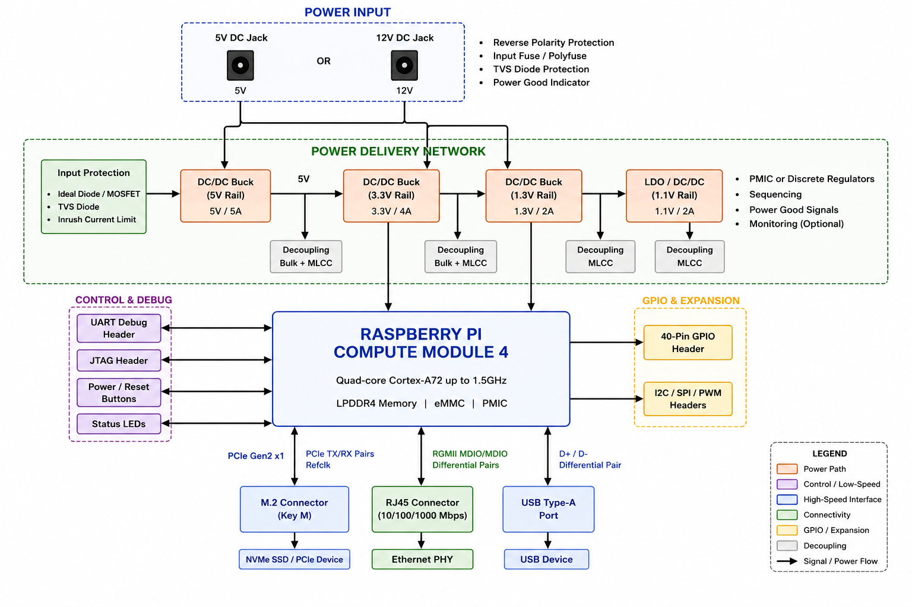

# High-Speed CM4 Carrier Board Design

## Overview

This project focuses on the design, simulation, implementation, and validation of a custom high-speed carrier board for the Raspberry Pi Compute Module 4 (CM4). The primary objective is to develop practical experience in high-speed digital hardware design, Signal Integrity (SI), Power Integrity (PI), PCB stackup optimization, and system bring-up methodologies commonly used in modern embedded computing platforms.

The board serves as a platform for exploring industry-standard design practices involving controlled-impedance routing, differential signaling, power delivery network design, and high-speed interface validation.

---

## Project Objectives

- Design a custom multi-layer PCB around the Raspberry Pi Compute Module 4
- Implement high-speed interfaces including PCIe, Gigabit Ethernet, and USB
- Develop an impedance-controlled PCB stackup
- Perform Signal Integrity (SI) analysis on high-speed interfaces
- Perform Power Integrity (PI) analysis on critical power rails
- Design and validate a multi-rail power delivery network
- Develop a structured board bring-up and validation procedure
- Document design decisions and engineering tradeoffs

---

## System Architecture

